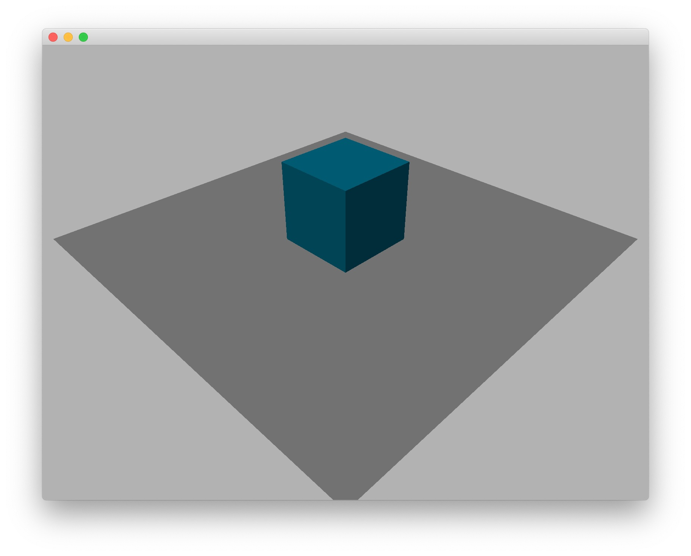

# Advanced User Manual 3: Load Model

## Load built-in models

The Ash Engine has 5 built-in basic models:

1. Cube
2. Sphere
3. Cone
4. Cylinder
5. Plane

### Example

The following code shows how to create several basic models, add them to the scene, and render them:

```cpp
int main(int argc, char *argv[]) {
    initApplication();

    QApplication a(argc, argv);

    // Step 1: Create an OpenGLWindow
    OpenGLWindow* window = new OpenGLWindow;
    window->resize(800, 600);

    // Step 2: Create an OpenGLRenderer for the window
    OpenGLRenderer* renderer = new OpenGLRenderer;
    window->setRenderer(renderer);

    // Step 3: Create a scene
    Scene* scene = new Scene;
    window->setScene(new OpenGLScene(scene));

    // Step 4: Customize your scene
    scene->addGridline(new Gridline);

    Model* cubeModel = ModelLoader::loadCubeModel();
    cubeModel->setPosition(QVector3D(0, 10, 0));
    cubeModel->setScaling(QVector3D(10, 10, 10));
    cubeModel->childMeshes()[0]->material()->setColor(QVector3D(0.0f, 0.8f, 1.0f));
    scene->addModel(cubeModel);

    Model* planeModel = ModelLoader::loadPlaneModel();
    planeModel->setPosition(QVector3D(0, 5, 0));
    planeModel->setScaling(QVector3D(50, 50, 50));
    scene->addModel(planeModel);

    DirectionalLight* light = new DirectionalLight(QVector3D(1, 1, 1), QVector3D(-2, -4, -3));
    scene->addLight(light);

    window->show();

    return a.exec();
}
```

Replace the `main` function in `src/AshEngine.cpp` with the above code, recompile and execute, you can get the following results:



## Load model from files

You can also load your own model from files. Common formats (`*.obj`, `*.fbx`, `*.3ds`, etc.) are supported. See [GitHub home page of assimp](https://github.com/assimp/assimp) for the complete list.

### Example

The following code shows how to load model from files:

```cpp
int main(int argc, char *argv[]) {
    initApplication();

    QApplication a(argc, argv);

    // Step 1: Create an OpenGLWindow
    OpenGLWindow* window = new OpenGLWindow;
    window->resize(800, 600);
    window->setEnableMousePicking(false); // Disable mouse picking to improve performance

    // Step 2: Create an OpenGLRenderer for the window
    OpenGLRenderer* renderer = new OpenGLRenderer;
    window->setRenderer(renderer);

    // Step 3: Create a scene
    Scene* scene = new Scene;
    window->setScene(new OpenGLScene(scene));

    // Step 4: Customize your scene
    ModelLoader loader;
    Model* model = loader.loadModelFromFile("/path-to-your-model/model.obj");
    scene->addModel(model);

    DirectionalLight* directionalLight = new DirectionalLight(QVector3D(1, 1, 1), QVector3D(-2, -4, -3));
    scene->addLight(directionalLight);

    window->show();

    return a.exec();
}
```

Replace the `main` function in `src/AshEngine.cpp` with the above code, replace `/path-to-your-model/model.obj` with the filepath of your own model, recompile and execute, and you can get results similar to the following:

